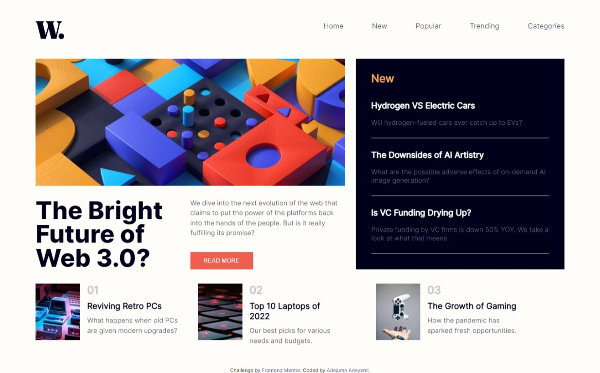
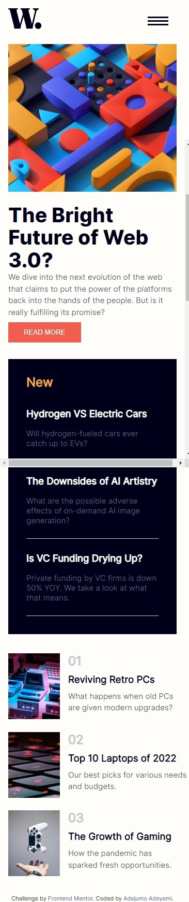

# Frontend Mentor - News homepage solution

This is a solution to the [News homepage challenge on Frontend Mentor](https://www.frontendmentor.io/challenges/news-homepage-H6SWTa1MFl). Frontend Mentor challenges help you improve your coding skills by building realistic projects. 

## Table of contents

- [Overview](#overview)
  - [The challenge](#the-challenge)
  - [Screenshot](#screenshot)
  - [Links](#links)
  - [Built with](#built-with)
  - [What I learned](#what-i-learned)
  - [Useful resources](#useful-resources)
- [Author](#author)

## Overview

### The challenge

Users should be able to:

- View the optimal layout for the interface depending on their device's screen size
- See hover and focus states for all interactive elements on the page
- Toggle the mobile menu

### Screenshot

### Links

- Solution URL: [Github repository](https://github.com/Ade-yem/news-homepage)
- Live Site URL: [Live site URL](https://news-hm-page.netlify.app/)

### Built with

- Semantic HTML5 markup
- CSS custom properties
- Flexbox

### What I learned

I found a way to make my overall styles more presentable and easier with some code snippets i found online . The styles are in the [universal css](./css/universal.css) file.

### Useful resources

- [W3 schools](https://www.w3schools.com/howto/howto_js_sidenav.asp) - This helped me to create the side navigation bar for the  mobile view.

## Author

- Website - [Adejumo Adeyemi](https://www.your-site.com)
- Frontend Mentor - [@Ade-yem](https://www.frontendmentor.io/profile/Ade-yem)
- Twitter - [@Adeh36462914](https://www.twitter.com/Adeh36462914)
